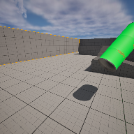

# Project Name  MDEVFall24

## Description

A github repository for the in class demonstration code for fall 2024 MDEV1003.    
 
## Usage
Clone, or download the zip, to a local directory. Open in Unreal Engine 5.4 or newer

## Attributions
1. Chucky Stabbing animation, Mixamo, ( https://www.mixamo.com/#/ )
2. Instructor model created with ReadyPlayer.Me
3.

